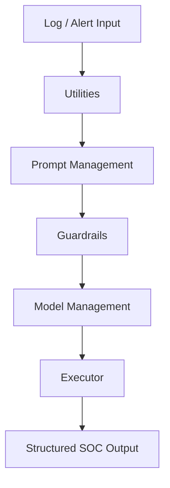

# 🤖 AI Agentic SOC Analyst

### Modular Python Framework for Autonomous Security Operations


> **AI Agentic SOC Analyst** is a modular Python-based framework designed to emulate and augment Tier 1–2 SOC analyst workflows using agentic AI patterns. The project focuses on **log triage, threat reasoning, guardrails, and controlled autonomous execution**.

---

## 🧠 Core Capabilities

* 🔍 **Autonomous Log Analysis** (SIEM-style context ingestion)
* 🧩 **Agentic Prompt Orchestration** with guardrails
* 🛡️ **Safety & Output Controls** to prevent hallucinations
* ⚙️ **Pluggable Model Management** (LLM-agnostic design)
* 📊 **Threat Context Enrichment** using structured data
* 🚦 **Decision-Gated Execution Flow**

---

## 🏗️ Architecture Overview



---

## 📦 Project Structure

```text
baseline_agent/
├── _main.py              # Entry point & execution flow
├── EXECUTOR.py           # Agent execution logic
├── PROMPT_MANAGEMENT.py  # Prompt construction & role logic
├── MODEL_MANAGEMENT.py   # Model selection, limits, and controls
├── GUARDRAILS.py         # Safety checks & response validation
├── UTILITIES.py          # Parsing, formatting, helper functions
├── _threats.jsonl        # Threat intelligence / examples
├── _keys.py              # API & workspace configuration (local)
```

---

## 🧩 Module Breakdown

| Module                   | Purpose                                                 |
| ------------------------ | ------------------------------------------------------- |
| **_main.py**             | Orchestrates the full agent workflow and runtime loop   |
| **EXECUTOR.py**          | Executes the agent decision chain and response handling |
| **PROMPT_MANAGEMENT.py** | Builds SOC-role-specific prompts and context            |
| **MODEL_MANAGEMENT.py**  | Handles model selection, rate limits, and thresholds    |
| **GUARDRAILS.py**        | Enforces safety, structure, and SOC-aligned outputs     |
| **UTILITIES.py**         | Shared helpers for parsing, formatting, and display     |
| **_threats.jsonl**       | Threat examples for grounding and reasoning             |

---

## 🚀 Quick Start

```bash
# Clone repository
git clone https://github.com/yourusername/ai-agentic-soc-analyst.git
cd ai-agentic-soc-analyst

# (Optional) Create virtual environment
python -m venv venv
source venv/bin/activate  # Windows: venv\\Scripts\\activate

# Install dependencies
pip install -r requirements.txt

# Run agent
python baseline_agent/_main.py
```

---

## 🔐 Security & Guardrails

This project intentionally implements **SOC-aligned constraints**:

* ❌ No uncontrolled command execution
* 📏 Output length and confidence thresholds
* 🧠 Reasoning validation before response delivery
* 🛑 Hallucination & escalation checks

These guardrails make the agent suitable for **defensive security research and demos**.

---

## 🎯 Use Cases

* SOC analyst workflow simulation
* AI-assisted alert triage
* Blue team automation research
* Agentic AI security experimentation
* Portfolio / demonstration project

---

## 🧪 Experimental Notes

* This is **not** a replacement for human analysts
* Designed for **controlled environments only**
* Model behavior depends on configuration and prompt discipline

---

## 📌 Roadmap

* [ ] MITRE ATT&CK technique mapping
* [ ] Multi-agent collaboration
* [ ] Memory & case history tracking
* [ ] SIEM-native integrations (Sentinel / Splunk)
* [ ] Web UI dashboard

---

## 📄 License

MIT License – see `LICENSE` for details.

---

## 👤 Author

**Marco Posadas**
Cybersecurity | Cloud | AI Security Research

🔗 [LinkedIn](https://linkedin.com)

---

⭐ *If you find this project useful, consider starring the repository!*
